# Simulador de CPU — Arquitectura Modular

Simulador educativo de una CPU de 16 bits con arquitectura modular (ALU, RAM, ROM, Bus, Ensamblador). Permite ensamblar una configuración de sistema, cargar programas de ejemplo, ejecutar pruebas y simular la ejecución de programas paso a paso o completa desde una interfaz de consola.
El enfoque de este proyecto fue replicar lo mas fiel a la realidad una CPU con un bus de 16bits, montando desde la unidad basica que serian las compuertas logicas, y usandolas para montar los cirucitos mas complejos que dan vida a una cpu

Versión: 1.0

---

## Contenido del repositorio 

```
├── 📁 Business
│   ├── 📁 Basic_Components
│   │   ├── 📁 Logic_Gates
│   │   │   ├── 🐍 AND_Gate.py # Mio
│   │   │   ├── 🐍 AND_Gate_4.py # ia
│   │   │   ├── 🐍 NOT_Gate.py # Mio
│   │   │   ├── 🐍 OR_Gate.py # Mio
│   │   │   ├── 🐍 OR_Gate_8.py # ia
│   │   │   ├── 🐍 XOR_Gate.py # mio
│   │   │   └── 🐍 __init__.py
│   │   ├── 🐍 Bit.py # Mio
│   │   ├── 🐍 Bus.py # Mio
│   │   ├── 🐍 Logic_Gate.py # ia
│   │   ├── 🐍 MUX3to1.py # ia
│   │   ├── 🐍 MUX4to1.py # ia
│   │   ├── 🐍 Record.py # mio
│   │   └── 🐍 __init__.py
│   ├── 📁 CPU_Core
│   │   ├── 📁 Arithmetic_Logical_Unit # Una mezcla de mano propia, e ia para corregir errores y hacer codigo repetitivo
│   │   │   ├── 📁 Arithmetic_Unit    
│   │   │   │   ├── 🐍 Arithmetic_Unit.py
│   │   │   │   ├── 🐍 Full_Adder.py
│   │   │   │   └── 🐍 __init__.py
│   │   │   ├── 📁 Logical_Unit 
│   │   │   │   ├── 🐍 Logical_MUX.py
│   │   │   │   ├── 🐍 Logical_Unit.py
│   │   │   │   └── 🐍 __init__.py
│   │   │   ├── 📁 Shift_Unit # sobretodo aqui con los motores de desplazamiento, yo hice el lsl, y en base a ese pedi que hiciera los demas
│   │   │   │   ├── 🐍 ASR.py
│   │   │   │   ├── 🐍 LSL.py
│   │   │   │   ├── 🐍 LSR.py
│   │   │   │   ├── 🐍 MUX2to1.py
│   │   │   │   ├── 🐍 MUX8to1.py
│   │   │   │   ├── 🐍 Multiplex.py
│   │   │   │   ├── 🐍 ROL.py
│   │   │   │   ├── 🐍 ROR.py
│   │   │   │   ├── 🐍 Shift_Unit.py
│   │   │   │   └── 🐍 __init__.py
│   │   │   ├── 🐍 ALU.py
│   │   │   ├── 🐍 ALU_MUX.py
│   │   │   └── 🐍 __init__.py
│   │   ├── 📁 Control_Unit # Esta parte si la hizo la ia en su totalidad, ya que no entendia bien que se conectaba con que
│   │   │   ├── 🐍 ControlStore.py
│   │   │   ├── 🐍 Control_Unit.py
│   │   │   ├── 🐍 Decoder.py
│   │   │   ├── 🐍 FSM.py
│   │   │   ├── 🐍 MicroCounter.py
│   │   │   ├── 🐍 Record_Bank.py # exepto esto, esto lo hice yo a mano
│   │   │   ├── 🐍 SignalGenerator.py
│   │   │   └── 🐍 __init__.py
│   │   ├── 🐍 CPU.py
│   │   └── 🐍 __init__.py
│   ├── 📁 Memory # ia
│   │   ├── 🐍 RAM.py
│   │   ├── 🐍 ROM.py
│   │   ├── 🐍 SystemBus.py
│   │   └── 🐍 __init__.py
│   ├── 🐍 Computer_System.py
│   └── 🐍 __init__.py
├── 📁 Data
│   └── 📁 Programs
│       └── ⚙️ Test.json
├── 📁 Diagramas-Prototipos
│   ├── 📄 E_S_Prototipo.puml
│   ├── 📄 Prototipo.puml
│   ├── 📄 Prototipo2.puml
│   ├── 📄 Prototipo3.puml
│   ├── 📄 Prototipo4.puml
│   ├── 📄 Prototipo5.puml
│   ├── 📄 Prototipo6.puml
│   └── 📄 aux.puml
├── 📁 Interface
│   └── 🐍 __init__.py
├── 📁 assets
│   └── 📁 Compuertas
├── 📁 data
├── 📁 docs # aqui esta algo de lo que iba investigando, sobretodo como eran algunos circuitos
│   ├── 📝 # File Tree: CPU_Simulator.md
│   ├── 📝 ALU_Mapeo_Control.md
│   ├── 🖼️ Esquema Full Adder.png
│   ├── 📝 ISA_Conjunto_Instrucciones.md
│   ├── 🖼️ MUX8to1.png
│   ├── 📄 Mux 2 to 1
│   └── 📕 Project_Simulador de Computador Digital_UNEG_2025_2.pdf
├── ⚙️ .gitignore
├── ⚙️ Plantilla.json
├── 🐍 aux.py
├── 🐍 main.py
├── ⚙️ pyproject.toml
├── 📄 requirements.txt
├── 🐍 setup.py
└── 🐍 test.py

# Este informe tambien use ia, ya que lo hice hoy, lo que puedo decir que es "propio" es el diagrama de clases, que lo hice en uml y despues pedi que me lo cambiara a mermaid
```
---

## Descripción general del proyecto

Este proyecto modela y simula una CPU simple (16 bits, dirección de ejemplo 12 bits, RAM de ejemplo 4 KB por defecto) mediante una arquitectura modular separando responsabilidades en módulos (Business). El simulador está pensado para:

- Ensamblar y configurar una "instancia" de sistema (CPU + memoria + bus + ALU).
- Cargar programas desde la carpeta `Data/` y ejecutarlos en modo paso a paso o completo.
- Ejecutar pruebas automáticas del sistema y conservar un historial.
- Ofrecer herramientas para inspeccionar el estado del sistema (registros, memoria, PC, etc.).

---

## Diagrama de clases

```mermaid
classDiagram
    %% -----------------------
    %% Componentes básicos
    %% -----------------------
    class Bit {
        - value: int
        + set(value)
        + get() int
        + toggle()
    }

    class Bus {
        - width: int
        - lines: List[Bit]
        + set_binary(value:int)
        + get_decimal() int
        + get_binary() List[int]
        + get_hex() string
        + get_line(index:int) Bit
    }

    class Logic_Gate {
        - inputs
        - output
        + evaluate()
    }

    class AND_Gate
    class OR_Gate
    class XOR_Gate
    class NOT_Gate
    class AND_Gate_4
    class OR_Gate_8

    class MUX2to1
    class MUX3to1
    class MUX4to1
    class MUX8to1

    class Record {
        - width: int
        - value: Bus
    }

    Logic_Gate <|-- AND_Gate
    Logic_Gate <|-- OR_Gate
    Logic_Gate <|-- XOR_Gate
    Logic_Gate <|-- NOT_Gate
    Logic_Gate <|-- AND_Gate_4
    Logic_Gate <|-- OR_Gate_8

    %% -----------------------
    %% ALU y subunidades
    %% -----------------------
    class Full_Adder {
        - a: Bit
        - b: Bit
        - cin: Bit
        - sum: Bit
        - cout: Bit
        + calculate()
    }

    class Arithmetic_Unit {
        - width: int
        - fas: List[Full_Adder]
        - sub_control: Bit
        + add(a:Bus,b:Bus,cin:Bit) (Bus,Bit)
        + calculate(a:Bus,b:Bus,mode)
    }

    class Logical_Mux {
        - inputs: List[Bus]
        + select(mode:Bus) Bus
    }

    class Logical_Unit {
        - width: int
        + and_op(a:Bus,b:Bus) Bus
        + or_op(a:Bus,b:Bus) Bus
        + xor_op(a:Bus,b:Bus) Bus
        + not_op(a:Bus) Bus
    }

    class ASR
    class LSL
    class LSR
    class ROL
    class ROR

    class Shift_Multiplex {
        - modes: List
        + select(mode) Bus
    }

    class Shift_Unit {
        - width: int
        - asr: ASR
        - lsl: LSL
        - lsr: LSR
        - rol: ROL
        - ror: ROR
        + calculate(a:Bus, mode:Bus) Bus
    }

    class ALU_MUX {
        + select(arith:Bus, logic:Bus, shift:Bus, mode:Bus) Bus
    }

    class ALU {
        - arithmetic: Arithmetic_Unit
        - logical: Logical_Unit
        - shift: Shift_Unit
        - output_mux: ALU_MUX
        - flags
        + execute(a:Bus,b:Bus,aluop:Bus,mode:Bus) (Bus, flags)
    }

    Arithmetic_Unit --> Full_Adder
    ALU --> Arithmetic_Unit
    ALU --> Logical_Unit
    ALU --> Shift_Unit
    ALU --> ALU_MUX
    Shift_Unit --> ASR
    Shift_Unit --> LSL
    Shift_Unit --> LSR
    Shift_Unit --> ROL
    Shift_Unit --> ROR
    Logical_Unit --> Logical_Mux

    %% -----------------------
    %% Unidad de control
    %% -----------------------
    class ControlStore {
        - memory: List[Bus]
        + read(address:int) Bus
        + load_from_file(path:string)
        + save_to_file(path:string)
    }

    class Decoder {
        - instruction: Bus
        + set_instruction(instr:Bus)
        + decode() (opcode, operands)
    }

    class FSM {
        - state
        + reset()
        + tick(inputs) 
    }

    class MicroCounter {
        - value: Record
        + reset()
        + increment()
        + load(val:int)
    }

    class Record_Bank {
        - PC: Record
        - IR: Record
        - AC: Record
        - MAR: Record
        - MDR: Record
        - TEMP: Record
        - HI: Record
        - LO: Record
        - FLAGS: dict
    }

    class SignalGenerator {
        + generate(control_word:Bus) dict
    }

    class Control_Unit {
        - control_store: ControlStore
        - decoder: Decoder
        - fsm: FSM
        - micro_counter: MicroCounter
        - records: Record_Bank
        - signal_generator: SignalGenerator
        + reset()
        + load_instruction(instr:Bus)
        + execute_cycle()
    }

    Control_Unit --> ControlStore
    Control_Unit --> Decoder
    Control_Unit --> FSM
    Control_Unit --> MicroCounter
    Control_Unit --> Record_Bank
    Control_Unit --> SignalGenerator

    %% -----------------------
    %% CPU
    %% -----------------------
    class CPU {
        - bus: SystemBus
        - registers: Record_Bank
        - alu: ALU
        - control: Control_Unit
        - running: bool
        + connect_memory(mem:RAM)
        + reset()
        + fetch()
        + execute()
        + run_cycle()
        + run_program(start:int, max_cycles:int)
    }

    CPU --> ALU
    CPU --> Control_Unit
    CPU --> Record_Bank

    %% -----------------------
    %% Memoria y Bus
    %% -----------------------
    class RAM {
        - size_kb: int
        - memory: List[int]
        + read(address:int) int
        + write(address:int, value:int)
        + dump(start:int,count:int) List[int]
    }

    class ROM {
        - base_path: string
        - programs_dir: string
        - assembler
        - test_history: List
        + create_system_assembler(config:Dict)
        + assemble_system(config:Dict) bool
        + list_programs() List[Dict]
        + load_program(filename:string) bool
        + run_program(mode:string, steps:int, max_cycles:int) bool
        + run_system_test() Dict
        + load_configuration(filename:string) Dict
    }

    class SystemBus {
        - data_bus: Bus
        - address_bus: Bus
        - control_bus: Bus
        - devices: Map
        + connect_device(dev, name, addr_range)
        + read(address:int, master:string) Bus
        + write(address:int, data:Bus, master:string)
        + reset()
    }

    SystemBus --> RAM
    SystemBus --> ROM

    %% -----------------------
    %% Computer System (envoltura)
    %% -----------------------
    class ComputerSystem {
        - cpu: CPU
        - ram: RAM
        - rom: ROM
        - bus: SystemBus
        + assemble(config:Dict, verbose:bool) bool
        + reset_all_components()
        + load_program_from_json(path:string) bool
        + run_program(mode:string, steps:int, max_cycles:int) bool
    }

    ComputerSystem --> CPU
    ComputerSystem --> RAM
    ComputerSystem --> ROM
    ComputerSystem --> SystemBus
```



## Clases y módulos principales (explicación)

Clases/módulos y sus responsabilidades (según uso en `main.py`):

- Business.Memory.ROM
  - Responsabilidad: punto de entrada para ensamblar/configurar el sistema y gestionar programas y pruebas.
  - Métodos detectados (usados por el menú):
    - create_system_assembler(config) — Prepara el ensamblador/sistema con la configuración opcional.
    - assemble_system(verbose=True) → bool — Ensambla y crea la instancia del sistema. Devuelve True si fue exitoso.
    - load_configuration(filename) → dict — Carga una configuración desde un archivo JSON.
    - list_programs() → list — Lista los programas disponibles en `Data/Programs/`.
    - load_program(filename) → bool — Carga un programa en memoria para ejecución.
    - run_system_test() — Ejecuta pruebas automáticas del sistema.
    - print_system_status() — Imprime el estado actual del sistema (registros, memoria, flags).
    - run_program(mode='step'|'full', steps=None, max_cycles=None) — Ejecuta el programa cargado en modo paso a paso o completo.
    - get_test_history(n) → list — Devuelve las últimas n entradas del historial de pruebas.

Módulos en Business (arquitectura lógica):
- CPU
  - Registros (PC, ACC, otros registros generales), lógica de ciclo de instrucción y control.
- ALU
  - Operaciones aritmético-lógicas, flags (zero, carry, overflow).
- Memory (ROM/RAM)
  - ROM: almacenamiento de programas/firmware.
  - RAM: memoria de datos (configurable, p. ej. 4 KB).
- Bus
  - Interconexión entre componentes (direccionamiento, lectura/escritura).
- Assembler / SystemAssembler
  - Traduce código ensamblador a binario/carga en ROM y prepara la topología del sistema.
- Logger / TestRunner
  - Ejecuta pruebas y guarda resultados en `logs/`.

---

## Cómo funciona (flujo típico de uso)

1. Iniciar la aplicación:
   - Ejecutar `python main.py` en la raíz del repositorio.
2. Crear y ensamblar el sistema (Menú → opción 1):
   - Se puede usar la configuración por defecto o proporcionar valores personalizados:
     - ancho de datos (bits), ancho de dirección (bits), tamaño de RAM (KB).
   - El ensamblador prepara ROM, RAM, CPU y conecta todo mediante el Bus.
3. Cargar configuración (Menú → opción 2):
   - Cargar un archivo JSON de configuración (p. ej. `default.json`) con parámetros del sistema.
4. Listar programas (Menú → opción 3):
   - Muestra los programas disponibles en `Data/Programs/` con metadatos.
5. Cargar programa (Menú → opción 4):
   - Seleccionar un programa de la lista y cargarlo en ROM o en la estructura correspondiente.
6. Ejecutar pruebas del sistema (Menú → opción 5):
   - Ejecuta baterías de tests automáticos. Resultados se registran en `logs/`.
7. Mostrar estado del sistema (Menú → opción 6):
   - Imprime registros, puntero de programa, algunos sectores de memoria, flags.
8. Ejecutar programa paso a paso (Menú → opción 7):
   - Permite ejecutar N pasos del ciclo de instrucción; útil para depuración.
9. Ejecutar programa completo (Menú → opción 8):
   - Ejecuta hasta completar (o hasta un número máximo de ciclos).
10. Ver historial de pruebas (Menú → opción 9).

---

## Flujo del programa

Resumen alto nivel del ciclo de ejecución
- Preparación: ROM/ensamblador crea la topología del sistema (ComputerSystem) con CPU, RAM y SystemBus.
- Carga: ROM/ProgramRepository lista y carga el programa en la memoria de programa (ROM) o en la estructura que usa el SystemBus.
- Ejecución: ComputerSystem/CPU inician el bucle principal: por cada instrucción hacen FETCH → DECODE → EXECUTE → (MEMORY) → WRITEBACK → actualizar PC y repetir hasta HALT o condición de parada.

Explicación paso a paso (detalle funcional)

1) Ensamblado y carga
- ROM.create_system_assembler(config) / ROM.assemble_system(...) o ComputerSystem.assemble():
  - Construyen instancias: SystemBus, RAM, ROM, CPU, Control_Unit, ALU, Record_Bank.
  - SystemBus conecta dispositivos y reservas rangos de direcciones (ROM para código, RAM para datos).
  - Resultado: ComputerSystem listo para recibir programas.

2) Cargar programa
- ROM.list_programs() muestra los programas en Data/Programs.
- ROM.load_program(filename) coloca el binario/JSON del programa en la ROM (o en la estructura que represente memoria de programa).
- Se actualiza metadata como punto de entrada (PC inicial) en Record_Bank.PC.

3) Iniciar ejecución (ComputerSystem.run_program / CPU.run_program)
- Se fija el PC al punto de entrada y se inicia un contador de ciclos.
- Bucle principal (por instrucción):
  - a) Fetch:
    - CPU.fetch():
      - SystemBus.read(PC, master="CPU") → obtiene la palabra/instrucción desde ROM.
      - Resultado se escribe en Record_Bank.IR.
  - b) Decode:
    - Control_Unit.load_instruction(IR) / Decoder.decode():
      - Decoder interpreta campos (opcode, registros, inmediato).
      - ControlUnit usa opcode + MicroCounter para consultar ControlStore (microcódigo) si existe microprogramación.
  - c) Microciclo(s) / Execute:
    - ControlStore.read(addr) o SignalGenerator.generate(control_word) entrega las microseñales del ciclo.
    - SignalGenerator traduce el control_word (bus de control) a señales físicas: habilitar ALU, seleccionar multiplexores, habilitar lectura/escritura a MAR/MDR, incrementar PC, etc.
    - ALU.execute(a, b, aluop, mode):
      - Arithmetic_Unit realiza sumas/restas (usa Full_Adder por bit si es simulación de puertas).
      - Logical_Unit ejecuta operaciones bitwise.
      - Shift_Unit hace desplazamientos/rotaciones.
      - ALU_MUX selecciona la salida final según aluop.
      - ALU actualiza flags (zero, carry, negative).
    - Memory ops:
      - Si la microsecuencia indica una lectura/escritura a memoria, la CPU usa SystemBus.read/write:
        - SystemBus.find_device(address) despacha a RAM.read / ROM.read (según mapeo).
    - Writeback:
      - Resultados de ALU o datos leídos de memoria se escriben en registros (Record_Bank) o en MDR/MAR según la microsecuencia.
  - d) Actualización de PC / Condicionales:
    - Si la instrucción fue un branch/jump, la control sequence modificará Record_Bank.PC según condición y flags.
    - Si no, PC se incrementa (normalmente por tamaño de instrucción).
  - e) Finalización de instrucción:
    - MicroCounter y FSM pueden resetearse para la siguiente instrucción.
    - Se anota el ciclo en logs si procede.
- Condiciones de parada: instrucción HALT, excepciones, o alcanzar max_cycles.

--

## Resumen de funcion de las clases

- Bit
  - Representa 0/1; usado por Bus y puertas. Durante el ciclo representa líneas individuales (p. ej. carry in/out).

- Bus
  - Agrupa Bits en vectores (por ejemplo bus de datos, bus de direcciones, bus de control). Durante fetch -> transporta la instrucción; durante execute -> lleva operandos y resultados.

- Logic_Gate, AND_Gate, OR_Gate, XOR_Gate, NOT_Gate, AND_Gate_4, OR_Gate_8
  - Componentes a nivel de puertas; en la práctica sirven para implementar Full_Adder, MUX y otras unidades. Durante operaciones aritméticas/lógicas a nivel de bit son evaluadas.

- MUX2to1, MUX3to1, MUX4to1, MUX8to1
  - Seleccionan entre múltiples entradas; usados intensamente en ALU (selección de operación, etapa de barrel shifter, selección resultado).

- Record
  - Contenedor de ancho fijo para almacenar un valor (ej.: PC, IR, MAR, MDR, AC). Durante el ciclo guarda el estado entre microciclos.

- Full_Adder, Arithmetic_Unit
  - Full_Adder: suma de 1 bit con carry; Arithmetic_Unit agrega múltiples Full_Adder en cadena para sumar Buses.
  - En EXECUTE, para instrucciones ADD/SUB la Arithmetic_Unit produce el resultado y el carry_out.

- Logical_Unit, Logical_Mux
  - Ejecutan AND/OR/XOR/NOT bitwise sobre Buses; Logical_Mux selecciona cuál operación de lógica se usa según el modo.

- Shift_Unit (ASR, LSL, LSR, ROL, ROR) y Shift_Multiplex
  - Realizan desplazamientos y rotaciones (barrel shifter). En instrucciones SHIFT, la CPU invoca Shift_Unit.calculate y su salida pasa por ALU_MUX.

- ALU_MUX y ALU
  - ALU orquesta Arithmetic_Unit, Logical_Unit y Shift_Unit; ALU_MUX selecciona el resultado final. ALU además calcula y exporta flags que condicionan saltos.

- ControlStore
  - Memoria de microinstrucciones (microcódigo). ControlUnit lee micropalabras desde aquí usando (opcode, microstep) para saber qué señales activar en cada microciclo.

- Decoder
  - Descompone IR (instrucción) en opcode y operandos; su salida guía la dirección dentro de ControlStore y los operandos para la ALU o accesos a memoria.

- FSM
  - Controla estados complejos (por ejemplo manejo de multiplicación/división por microciclos) y señales de inicio/fin. En ejecución coordina pasos especiales.

- MicroCounter
  - Cuenta microciclos dentro de una instrucción (ej.: paso 0 fetch, paso 1 decode, paso 2 execute, etc.). Se usa para indexar ControlStore.

- Record_Bank
  - Banco de registros del CPU (PC, IR, AC, MAR, MDR, TEMP, HI, LO) y flags. En WRITEBACK y FETCH guarda/lee valores usados por la CPU.

- SignalGenerator
  - Convierte una palabra de control (control_word) leída en ControlStore a señales de control concretas (habilitar ALU, MUX selects, read/write en RAM, etc.).

- Control_Unit
  - Motor que, dada la instrucción (IR), usa Decoder, MicroCounter y ControlStore para generar las microsecuencias necesarias. Cada microciclo llama a SignalGenerator para aplicar señales a la CPU/ALU/Bus.

- CPU
  - Orquesta el ciclo fetch-decode-execute. Interactúa con Control_Unit, ALU y SystemBus. En cada run_cycle:
    - fetch(): SystemBus.read(PC) → IR
    - execute(): delega a Control_Unit para activar microsecuencias que usan ALU y acceden a RAM a través del SystemBus
    - Actualiza registros en Record_Bank y PC.

- RAM
  - Provee read/write para datos; SystemBus despacha lecturas/escrituras. En MEMORY phase (por ejemplo LOAD/STORE) RAM devuelve o almacena datos.

- ROM
  - Almacena programas y (en este proyecto) actúa como fachada: crea el ensamblador, lista programas, carga y lanza tests. Cuando CPU fetch usa SystemBus.read y la dirección cae en el rango ROM, SystemBus lee desde ROM.

- SystemBus
  - Mediador entre CPU y dispositivos. Mapea direcciones a dispositivos y despacha read/write. Maneja conflictos sencillos (bus_request/bus_grant si se modela).

- ComputerSystem
  - Wrapper de alto nivel que agrupa CPU, RAM, ROM y SystemBus. Provee métodos sencillos: assemble, reset_all_components, load_program_from_json, run_program; usado por ROM y por la interfaz principal.

--

## Diagrama de flujo

```mermaid
flowchart TD
    %% ===== INICIO =====
    Start([Inicio del simulador])
    Start --> Init[Inicializar entorno]
    Init --> MainMenu
    
    %% ===== MENÚ PRINCIPAL =====
    MainMenu{Menú principal}
    
    MainMenu -->|1| Op1[Crear y ensamblar sistema]
    MainMenu -->|2| Op2[Cargar configuración]
    MainMenu -->|3| Op3[Listar programas]
    MainMenu -->|4| Op4[Cargar programa]
    MainMenu -->|5| Op5[Ejecutar prueba]
    MainMenu -->|6| Op6[Mostrar estado]
    MainMenu -->|7| Op7[Ejecutar paso a paso]
    MainMenu -->|8| Op8[Ejecutar completo]
    MainMenu -->|9| Op9[Ver historial]
    MainMenu -->|0| Op0[Salir]
    MainMenu -->|*| Inv[Opción inválida]
    
    %% ===== OPCIÓN 1 =====
    Op1 --> AskCustom{Configuración?}
    AskCustom -->|Sí| C1[Pedir parámetros]
    AskCustom -->|No| C2[Usar por defecto]
    
    C1 --> Assemble1[Ensamblar sistema]
    C2 --> Assemble1
    
    Assemble1 --> Result1{¿Éxito?}
    Result1 -->|Sí| Ok1[Sistema ensamblado]
    Result1 -->|No| Err1[Error]
    
    Ok1 --> Pause1[Enter para continuar]
    Err1 --> Pause1
    Pause1 --> MainMenu
    
    %% ===== OPCIÓN 2 =====
    Op2 --> ConfigFile[Pedir archivo]
    ConfigFile --> LoadConf[Cargar configuración]
    LoadConf --> ShowConf[Mostrar parámetros]
    ShowConf --> Pause2[Enter para continuar]
    Pause2 --> MainMenu
    
    %% ===== OPCIÓN 3 =====
    Op3 --> ListProg[Listar programas]
    ListProg --> CheckList{¿Vacío?}
    CheckList -->|Sí| NoProg[Sin programas]
    CheckList -->|No| ShowProg[Mostrar lista]
    
    NoProg --> Pause3[Enter para continuar]
    ShowProg --> Pause3
    Pause3 --> MainMenu
    
    %% ===== OPCIÓN 4 =====
    Op4 --> CheckAssembled4{¿Sistema listo?}
    CheckAssembled4 -->|No| NeedAssemble4[Primero ensamble]
    CheckAssembled4 -->|Sí| ShowPrograms4[Listar programas]
    
    NeedAssemble4 --> Pause4b[Enter para continuar]
    Pause4b --> MainMenu
    
    ShowPrograms4 --> SelectProg[Seleccionar]
    SelectProg --> LoadProg[Cargar programa]
    LoadProg --> LoadResult{¿Éxito?}
    LoadResult -->|Sí| LoadOk[Programa cargado]
    LoadResult -->|No| LoadFail[Error carga]
    
    LoadOk --> Pause4[Enter para continuar]
    LoadFail --> Pause4
    Pause4 --> MainMenu
    
    %% ===== OPCIÓN 5 =====
    Op5 --> CheckAssembled5{¿Sistema listo?}
    CheckAssembled5 -->|No| NeedAssemble5[Primero ensamble]
    CheckAssembled5 -->|Sí| RunTest5[Ejecutar prueba]
    
    NeedAssemble5 --> Pause5b[Enter para continuar]
    Pause5b --> MainMenu
    
    RunTest5 --> ShowTestRes[Mostrar resultados]
    ShowTestRes --> Pause5[Enter para continuar]
    Pause5 --> MainMenu
    
    %% ===== OPCIÓN 6 =====
    Op6 --> CheckAssembled6{¿Sistema listo?}
    CheckAssembled6 -->|No| NeedAssemble6[Primero ensamble]
    CheckAssembled6 -->|Sí| ShowStatus[Mostrar estado]
    
    NeedAssemble6 --> Pause6b[Enter para continuar]
    Pause6b --> MainMenu
    
    ShowStatus --> Pause6[Enter para continuar]
    Pause6 --> MainMenu
    
    %% ===== OPCIÓN 7 =====
    Op7 --> CheckAssembled7{¿Sistema listo?}
    CheckAssembled7 -->|No| NeedAssemble7[Primero ensamble]
    CheckAssembled7 -->|Sí| AskSteps7[Pedir pasos]
    
    NeedAssemble7 --> Pause7b[Enter para continuar]
    Pause7b --> MainMenu
    
    AskSteps7 --> RunStep7[Ejecutar paso a paso]
    RunStep7 --> Pause7[Enter para continuar]
    Pause7 --> MainMenu
    
    %% ===== OPCIÓN 8 =====
    Op8 --> CheckAssembled8{¿Sistema listo?}
    CheckAssembled8 -->|No| NeedAssemble8[Primero ensamble]
    CheckAssembled8 -->|Sí| AskCycles8[Pedir ciclos]
    
    NeedAssemble8 --> Pause8b[Enter para continuar]
    Pause8b --> MainMenu
    
    AskCycles8 --> RunFull8[Ejecutar completo]
    RunFull8 --> Pause8[Enter para continuar]
    Pause8 --> MainMenu
    
    %% ===== OPCIÓN 9 =====
    Op9 --> GetHistory[Obtener historial]
    GetHistory --> CheckHist{¿Vacío?}
    CheckHist -->|Sí| NoHist[Sin pruebas]
    CheckHist -->|No| ShowHist[Mostrar historial]
    
    NoHist --> Pause9[Enter para continuar]
    ShowHist --> Pause9
    Pause9 --> MainMenu
    
    %% ===== OPCIÓN 0 =====
    Op0 --> Exit[Salir]
    Exit --> End([Fin])
    
    %% ===== OPCIÓN INVÁLIDA =====
    Inv --> ShowInv[Opción inválida]
    ShowInv --> PauseInv[Enter para continuar]
    PauseInv --> MainMenu
    
    %% ===== CICLO DE CPU =====
    RunStep7 --> CPUCycleStart
    RunFull8 --> CPUCycleStart
    
    subgraph CPUCycle [Ciclo de CPU]
        CPUCycleStart[Iniciar ejecución] --> CheckStop{¿HALT o máximo?}
        
        CheckStop -->|Sí| Finish[Finalizar ejecución]
        CheckStop -->|No| Fetch[FETCH: Leer instrucción]
        
        Fetch --> Decode[DECODE: Decodificar]
        Decode --> GetControl{¿Microcódigo?}
        
        GetControl -->|Sí| Micro[Leer microcódigo]
        GetControl -->|No| Signals[Generar señales]
        
        Micro --> Signals
        Signals --> Apply[Aplicar señales]
        Apply --> ALUCheck{¿Operación ALU?}
        
        ALUCheck -->|Sí| ALUExec[Ejecutar ALU]
        ALUCheck -->|No| SkipALU[Saltar ALU]
        
        ALUExec --> UpdateFlags[Actualizar flags]
        SkipALU --> UpdateFlags
        
        UpdateFlags --> MemCheck{¿Memoria?}
        MemCheck -->|Sí| MemAccess[Acceder memoria]
        MemCheck -->|No| SkipMem[Saltar memoria]
        
        MemAccess --> WriteBack1[Writeback]
        SkipMem --> WriteBack1
        
        WriteBack1 --> UpdatePC[Actualizar PC]
        UpdatePC --> UpdateCounter[Actualizar contadores]
        UpdateCounter --> CPUCycleStart
    end
    
    Finish --> ShowSummary[Mostrar resumen]
    ShowSummary --> MainMenu
    
    %% ===== ESTILOS =====
    style Err1 fill:#fdd
    style LoadFail fill:#fdd
    style ShowInv fill:#fdd
    style NeedAssemble4 fill:#ffd
    style NeedAssemble5 fill:#ffd
    style NeedAssemble6 fill:#ffd
    style NeedAssemble7 fill:#ffd
    style NeedAssemble8 fill:#ffd
```


--

## Manual de usuario (rápido)

Requisitos
- Python 3.8+ (recomendado 3.10+)
- Instalar dependencias:
  - pip install -r requirements.txt

Ejecutar el simulador
- Desde la raíz del repo:
  - python main.py

Interfaz
- Es una interfaz de consola con un menú numérico.
- Seleccione la opción ingresando el número y presionando Enter.
- En opciones que esperan entradas (ej.: tamaño de RAM) se puede dejar vacío para usar el valor por defecto.

Ejemplo de sesión rápida
1. python main.py
2. En el menú: 1 → (crear y ensamblar sistema). Responder `n` para configuración personalizada o `s` y proporcionar valores si lo desea.
3. 3 → listar programas (identifique el programa que quiera).
4. 4 → cargar programa (seleccione por número).
5. 7 → ejecutar paso a paso (indicar número de pasos) o 8 → ejecutar completo (indicar max de ciclos).
6. 6 → ver estado del sistema tras ejecución.
7. 9 → consultar historial de pruebas.

Formato de programas
- Los programas se buscan en `Data/Programs/`. Cada entrada listada por `list_programs()` incluye nombre, archivo, cantidad de instrucciones y punto de entrada.
- Si crea programas nuevos, siga el formato de los ejemplos existentes dentro de `Data/Programs/`.

---

## Ejemplos de comandos útiles

- Ensamblar sistema con valores por defecto:
  - En el menú: 1 → n (no usar configuración personalizada)
- Ensamblar con valores personalizados:
  - 1 → s → ingresar `16` (data width), `12` (address width), `4` (RAM KB)
- Ejecutar 20 pasos:
  - 7 → ingresar `20`
- Ejecutar programa completo con máximo 500 ciclos:
  - 8 → ingresar `500`

--